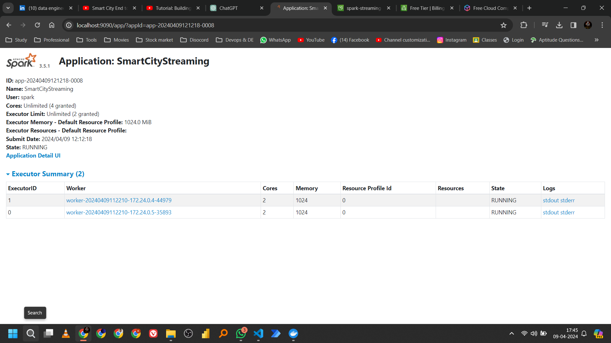
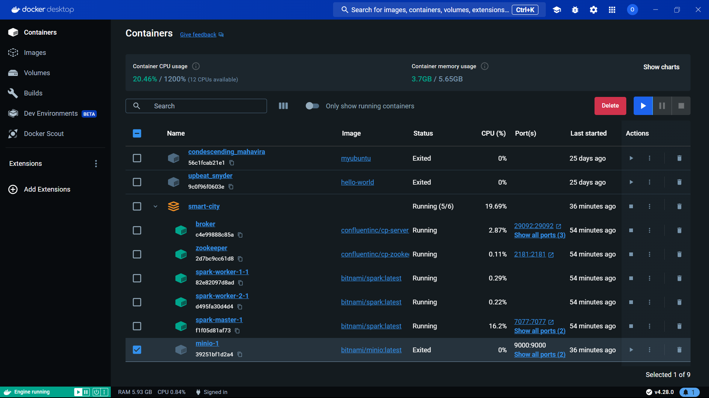

# Smart City End to End Project

This README provides instructions for setting up a data engineering project for simulating data generation using Python for Apache Kafka, processing the data with Apache Spark, and storing it in Amazon S3. All services will be orchestrated and run on Docker containers.

## Project Overview

The Smart City Data Engineering project aims to simulate and process real-time data streams from various sources such as vehicles, GPS devices, weather stations, and traffic cameras. The project utilizes Apache Kafka for message queuing and distribution, Apache Spark for stream processing, and Amazon S3 for data storage.

## Components

### 1. Kafka Simulation

Simulate data streams for the following topics:

- `vehicle`
- `gps`
- `weather`
- `traffic_camera`


### 2. Apache Spark Processing

Process the data streams using Apache Spark to perform real-time analytics, aggregation, and transformation.



### 3. Amazon S3 Storage

Store the processed data in Amazon S3 for long-term storage and analysis.


### 4. Docker Containers

All services will be containerized using Docker for easy deployment and management.




## Setup Instructions

To run this project you need to have the following installed on your machine:

- [Docker](https://www.docker.com/)
- [Java JDK 8 or later](http://www.oracle.com/technetwork/java/javase/downloads/index.html)
- [Python]()

### - `jobs/config.py` add you AWS Credentials
### - Create Venv and install  `requirements.txt`
```bash
$ python3 -m venv env
$ source env/bin/activate
$ pip install -r requirements.txt
```
### - Compose up the `docker-compose.yml` file.

```bash
$ docker-compose up --build
```

## Conclusion

You have successfully set up a data engineering project for simulating data generation using Python for Apache Kafka, processing the data with Apache Spark, and storing it in Amazon S3. By running all services on Docker containers, you can easily deploy and manage the entire data pipeline.

Feel free to customize and extend the project to incorporate additional data sources, processing logic, or storage destinations as needed for your smart city application.

For more information on Docker, Apache Kafka, Apache Spark, and Amazon S3, refer to their respective documentation:

- [Docker Documentation](https://docs.docker.com/reference/)
- [Apache Kafka Documentation](https://kafka.apache.org/documentation/)
- [Apache Spark Documentation](https://spark.apache.org/docs/latest/)
- [Amazon S3 Documentation](https://docs.aws.amazon.com/AmazonS3/latest/userguide/GetStartedWithS3.html)
- [Maven Repo](https://mvnrepository.com/)


## Authors

- [@riteshojha](https://www.github.com/ritesh-ojha)

